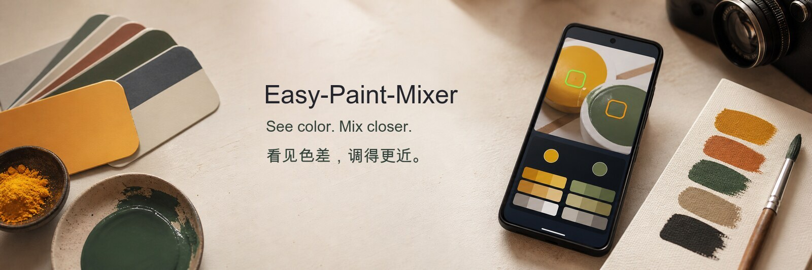
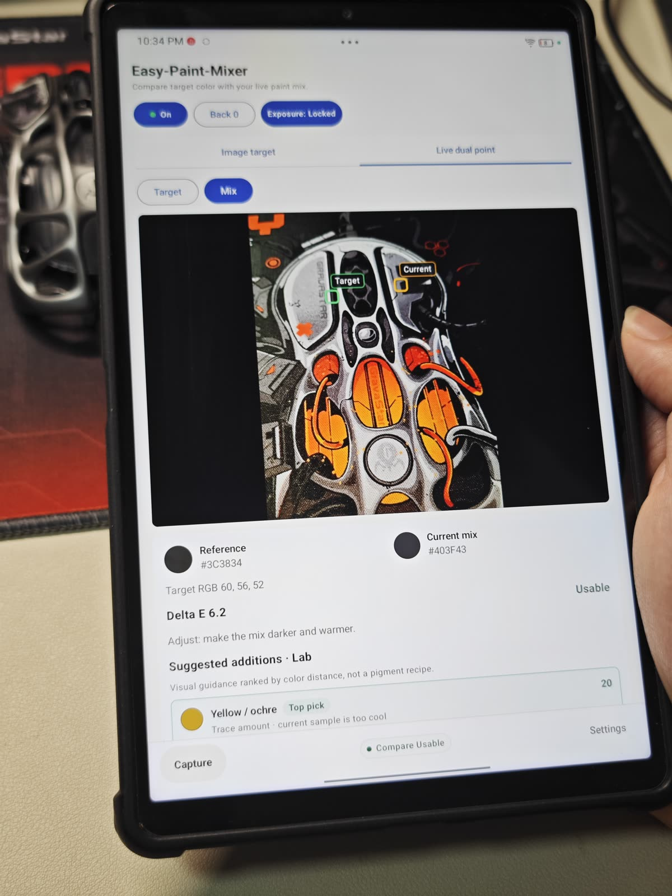
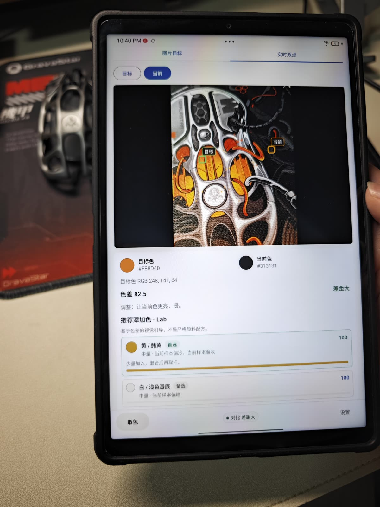
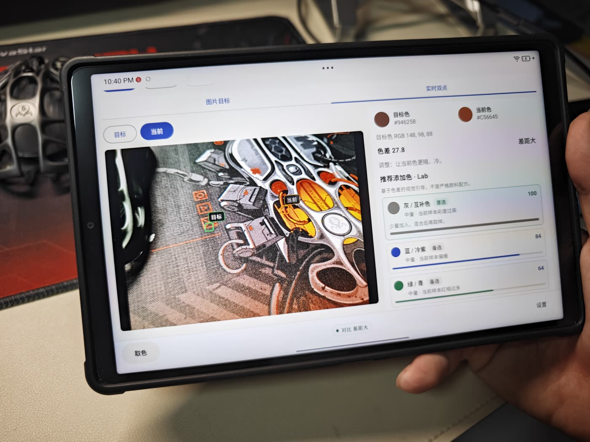
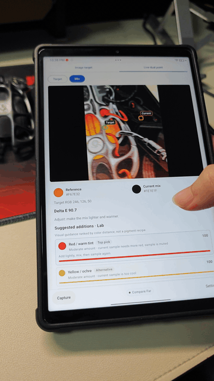

# Easy-Paint-Mixer

[English](README.md) | 简体中文

一个开源 Android 现场调色辅助工具，用于对比目标色与镜头中的当前调色。


[下载 APK](https://github.com/Andrew-AI-Kitchen/Easy-Paint-Mixer/releases) · [版本说明](docs/release-notes.md) · [创作者主页](https://github.com/Andrew-AI-Kitchen)



---

## 实机预览

来自平板真机的实拍画面：

| 竖屏英文 | 竖屏中文 | 横屏中文 |
|---|---|---|
|  |  |  |



**演示视频：** [easy-paint-mixer-demo-720p.mp4](docs/assets/easy-paint-mixer-demo-720p.mp4)

## 为什么做 Easy-Paint-Mixer

现场调色很多时候追求的是“更快接近”，而不是实验室级精确测量。手机摄像头不是校准过的检测仪器，但它仍然可以帮助你对比：

- 从参考图片中点选出的目标色
- 实时摄像头画面中的目标点
- 当前调色、样本或物体表面的颜色

Easy-Paint-Mixer 关注的是快速视觉对比和可重复的取样点。它适合艺术创作、手工制作、教学实验，以及任何想要一个轻量开源调色辅助工具的人。

## 功能

- **图片目标模式** — 从照片中点选目标色，再与实时镜头中的当前色对比。
- **实时双点模式** — 在摄像头画面中放置目标点和当前点，用于现场快速对比。
- **持续实时取样** — 已选取样点约每 200ms 自动更新一次。
- **颜色读数** — 显示 Hex、RGB 和 Delta E 色差。
- **视觉引导建议** — 可在 Lab、HSV、HSI、RGB 模式下查看推荐添加色方向。
- **相机控制** — 摄像头开关、具体摄像头选择、曝光锁切换和基础预设。
- **中英文界面** — 支持 English / 简体中文切换。
- **本地优先隐私** — 图片和摄像头画面只在设备本地处理。
- **手机布局适配** — 支持基础竖屏/横屏和系统导航栏安全区域。

## 重要免责声明

手机摄像头和屏幕不是校准过的测量仪器。

Easy-Paint-Mixer 只提供**视觉调色辅助**。它不能作为车漆、纺织品、试剂、实验室样本或工业颜色合规鉴定依据。当前推荐添加色基于色差启发式算法，并不是严格颜料混合公式。

## 下载

从 [Releases](https://github.com/Andrew-AI-Kitchen/Easy-Paint-Mixer/releases) 页面下载最新 APK。

| 构建类型 | 文件 | 用途 |
|---|---|---|
| Alpha | `Easy-Paint-Mixer-0.1.0-alpha.apk` | 真机通过文件管理器安装 |

## Android 使用说明

1. 从 Releases 下载 APK。
2. 在 Android 设备上打开 APK 文件，点击“安装”。
3. 打开 Easy-Paint-Mixer。
4. 选择 **图片目标** 或 **实时双点**。
5. 放置目标色/当前色取样点，并查看色差和视觉引导建议。

## 从源码构建

需要：

- Android Studio 或 Android SDK 命令行工具
- JDK 17
- Android SDK 36

```bash
cd android
./gradlew assembleDebug
./gradlew assembleAlpha
```

APK 输出位置：

```text
android/app/build/outputs/apk/alpha/app-alpha.apk
```

## 项目范围

Easy-Paint-Mixer 是一个轻量级视觉辅助工具。它专注于：

- 实时颜色取样
- 目标色与当前色对比
- 简单的推荐添加色方向
- 开源、本地优先的使用方式

它**不**：

- 替代校准过的色差仪或分光测色仪
- 保证工业颜色合规
- 提供严格的颜料混合模型
- 上传摄像头画面或样本图片

## 已知限制

- Alpha 版本，可能存在 bug 和不完整功能。
- 颜色结果会受到摄像头、曝光、白平衡、屏幕和环境光影响。
- 曝光锁可以帮助稳定实时对比，但不是完整设备校准。
- 推荐添加色是启发式视觉引导，不是最终调色指令。
- 摄像头标签使用 Android camera ID，不同设备可能不同。

## 路线图

- [ ] 灰卡/白卡校准流程
- [ ] 更好的摄像头名称和设备能力展示
- [ ] 用户自定义颜料/色料库
- [ ] 调色历史和项目笔记
- [ ] 可导出的颜色对比记录
- [ ] F-Droid metadata 和可复现开源发布流程

## 许可证

[MIT](LICENSE)
